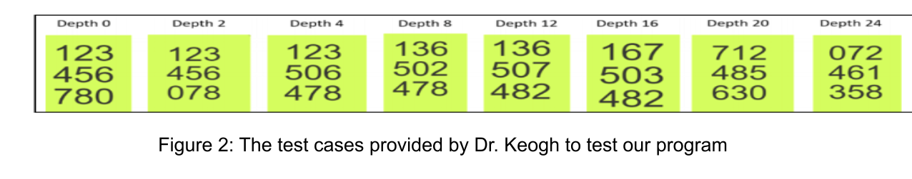

# Eight Puzzle Solver

## Introduction

The Eight Puzzle is a type of sliding tile puzzle that involves a 3x3 grid of squares that are numbered and has one square that is empty. Initially, these numbers are scrambled in random order on the grid. The player's goal is to order these numbers using the fewest moves possible.

" width = "500" />

For this project, I implemented an Eight Puzzle solver using C++. Using this programming langauge helped me learn about its advanced capabilties as well as increase my mastery of the lanaguage. Within this project, I implemneted three unique algorithms that are capable of solving this type of puzzle. These include Uniform Cost Search, A* with a Misplaced Tile Heuristic, and A* with a Manhattan Distance Heuristic. The overall performance of these algorithms is evaluated and shown below.

Throughout this project, I consulted the following resources:

1. Dr. Eamonn Keogh's Lecture slides on Blind Search and Heursitic Search

    - [a. 2__Blind Search_part1.pptx](https://www.dropbox.com/sh/rltooq0t3khobuj/AAA3MYkZc8gb1RLa3tNSnsrga?dl=0&preview=2__Blind+Search_part1.pptx)
	- [b. 2__Blind Search_part2.pptx](https://www.dropbox.com/sh/rltooq0t3khobuj/AAA3MYkZc8gb1RLa3tNSnsrga?dl=0&preview=2__Blind+Search_part2.pptx)
   	- [c. 3__Heuristic Search.pptx](https://www.dropbox.com/sh/rltooq0t3khobuj/AAA3MYkZc8gb1RLa3tNSnsrga?dl=0&preview=3__Heuristic+Search.pptx)
	- [d. Eight-Puzzle_briefing_and_review_of_search.pptx](https://www.dropbox.com/sh/rltooq0t3khobuj/AAA3MYkZc8gb1RLa3tNSnsrga?dl=0&preview=Eight-Puzzle_briefing_and_review_of_search.pptx)

2. C++11 Documentation 

    - [a. cplusplus.com](https://cplusplus.com/doc/)

3. The following are libraries and predefined subroutines I included in my program to help with node manipulation:
    - The Queue Library to access the priority_queue data type
    - The Copy Constructor Syntax in order to perform Deep Copy on nodes
    - The operator() Overload Syntax in order to compare f(n) costs between nodes to correctly input them into the priority_queue
    - The operator= Overload Syntax to assign member variables from one node to another

## The Search Algorithms

### Uniform Cost Search

Uniform Cost Search, also known simply as UCS, is a type of Blind Search Algorithm. As explained by Dr. Keogh in his Blind Search PowerPoint slides, this algorithm expands the cheapest node. This is done by enqueueing the nodes in order of cumulative cost. For this algorithm, the g(n) is simply the cost to get to state n from the initial state. Uniform Cost Search is complete and optimal only if the “path cost is a nondecreasing function of depth.” As explained in the Project 1 requirements, UCS is just A* with h(n) hardcoded to zero. Its Time and Space Complexities are both O(bd), where b is the average branching factor and d is the depth of the tree. 

### A* with the Misplaced Tile Heuristic

The A* algorithm is known as the fastest search algorithm. It combines the completeness and optimality of Uniform Cost Search with the fast time complexity of Hill-Climbing Search. As explained by Dr. Keogh, the algorithm enqueues nodes “in order of estimated cost to goal f(n).” Here, f(n) is the cost to get to a particular node, g(n), plus the estimated distance to the goal, h(n). The h(n) is known as the type of heuristic used in the algorithm. A heuristic is a function that approximates how far the current state is to the goal state. We only use heuristics that are admissible, which means they never overestimate the “merit of a state.” One of the heuristics used in this project is known as the Misplaced Tile Heuristic. For this heuristic, we simply compare the current state with the goal state by counting the number of misplaced tiles.

### A* with the Manhattan Distance Heuristic

This algorithm is similar to the Misplaced Tile Heuristic in that it uses A* to search through the nodes. In this case, we use the Manhattan Distance Heuristic instead. For this heuristic, we compare the current state with the goal state by counting the total number of spaces all misplaced tiles are away from their individual correct positions. 

## Algorithm Analysis

For this project, I decided to compare all three algorithms in terms of their runtime and the number of nodes they expanded when searching for the goal state. To do this, I used eight test cases that were provided by Dr. Keogh in the Project 1 Requirements. The test cases can be seen in Figure 2. Tracebacks of an easy and hard test case are provided at the end of the report. I did not include the full traceback for the hard puzzle in order to save space, given its depth is 20.

